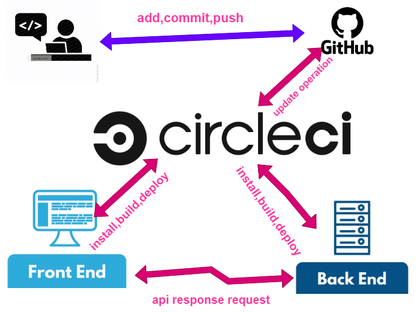

# pipeline
***CICD***

we develope new application or make update on the application but we need to a set of instructions that will be executed on a server with the goal of building and deploying the application.  
then the solution is to use pipeline.
- ***An efficient pipeline can benefit developers in the following ways:*** 
  - Faster feedback about the code
  - Getting features deployed faster
her we use circleci as pipeline-as-a-service.CircleCI presents a great set of features and has the advantage of being popular in the industry.

## how it work
***The developers*** develope application and push his code to ***GitHub*** repository which is linked to the ***CircleCI*** then triggers the CircleCI and told it that new code pushed to the repository. ***CircleCI***
 use ***config.yml*** file which tell them the instruction and workflow.***CircleCI*** run all ***config.yml*** instruction that install,build and deploy the application for frontend ***s3 bucket*** and for ***aws eb*** server using environment variables that we stored it in ***circleci*** site in environment variable area. 
then the users can interact with ***eb*** server using ***s3*** frontend

this is the diagram for this process.

